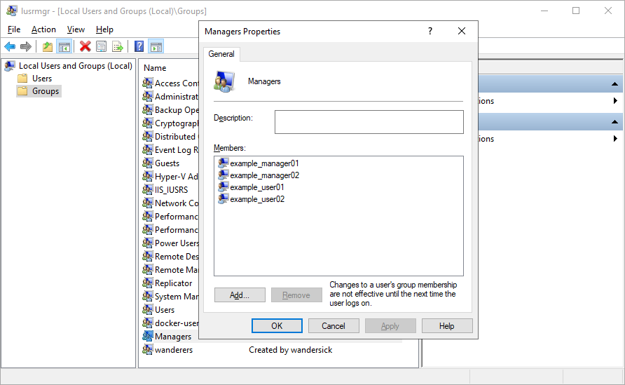

# Automate Windows Group Member Update via CSV File or LDAP Query with PowerShell

Designed for Windows admins, this PowerShell script `ws-dynamic-group` automates the addition or removal of group members in a Windows local or AD domain group based on content in a CSV file or an LDAP query, turning a static group into a dynamic one.

Preventive features such as setting a threshold to avoid deletion of a massive number of group members by mistake, logging and mail alerts are also available.

## List of Features

* Keeping track of a specified CSV file for adding or removing group members in a local/domain group by comparing the group members of the file with group members on a system. (For scheduling, add it to a task using the built-in Windows Task Scheduler)
  * If group members exist in CSV file but not in system, add the usernames
  * If group members exist in system but not in CSV file, delete the usernames
* Specify usernames of group members dynamically or statically
  * Dynamic mode: the CSV input file can be created dynamically according to an LDAP query (specified in the script) from a live Active Directory domain
  * Static mode: the input CSV file can also be pre-created (at a location and file name defined in the script)
* Settings can be supplied via command-line switches or by editing the script
  * For example, the group name can be specified via `customGroupName` in the upper [variable section within the script](#script-settings) or by running the script with `-groupName` command-line switch as in `ws-dynamic-group.ps1 -groupName managers`
* Apply the modifications (addition/deletion of group member) to the system either locally (workgroup) or on a domain controller (Active Directory)
  * There is support for both local (workgroup) and domain (Active Directory) environments. (Refer to [Script Settings](#Script-Settings) section)
* Skip group member deletion if there is a mistake on the source side (e.g. content in CSV file is wrong) when a configurable threshold is reached
  * Email alerts can be additionally configured to report on the event of skipping group member deletion due to reaching a specified threshold, so that admins can take action accordingly
* There are 3 types of logging supported
  * Lists of group members "before" and "after" running the script are saved separately for each run under the directory `03_Done`
    * The script backs up all users beforehand and afterwards to facilitate troubleshooting and comparison in times of need
  * Console output logging (everything displayed during the session) is stored in a named file using the date and time of each execution under the script log directory: `_log\Executions\console_log-<current_date_time>.log` using `Start-Transcript` of PowerShell
  * Action logging (group member additions and deletions), appending to the same CSV file under script log folder: `_log\action_log-<group_name>.csv`
    * Six columns are available: `date time directory_mode group action account`

Refer to [Flow](#flow-of-the-script) section for more details.

## Quick Start

1. Store the script with its complete [directory structure](#Directory-Structure) in a location specified in the script (Default: C:\ws-dynamic-group)
2. Create '01_Incoming\incoming.csv' according to the section [CSV File Schema](#CSV-File-Schema).
3. In Windows Task Scheduler, create a task that runs `ws-dynamic-group.ps1`

### Command Example

```PowerShell
# Be sure to create the group (domain or local group) beforehand, e.g. in the example below, "managers".
ws-dynamic-group.ps1 -csvPath "C:\ws-dynamic-group\01_Incoming\incoming.csv" -groupName "managers" -force $true
```

Refer to [Script Settings](#script-settings) section for details about the syntax and in-script settings.

## Prerequisites

* A machine of Windows or Windows Server which can run PowerShell from the required modules, where:
  * PowerShell module, `Microsoft.Powershell.LocalAccounts`, is required for "local" mode
  * PowerShell module, `ActiveDirectory`, is required for "domain" mode (and only domain controllers are supported)
* The group must be pre-created in the target system
  * If the specified group is not created, the script cannot continue
* Administrator rights
  * The script must be executed with a user account in the AD group 'Domain Admins' for the 'Domain' mode or 'Administrators' group for the 'Local' mode, in order to add or delete group members successfully
* Notes for 'static' input mode
  * incoming.csv must be a complete file containing all the users (usernames) of the specified groups which must be processed.
    * For example, if there are only a few group members in the CSV when the group in the live system actually has a lot of members, this will be regarded as an intentional deletion of all the group members from the group except those in the CSV file. (Mistakes may be prevented by configuring `userDeletionThreshold` threshold)
* Refer to the notes under the section [CSV File Schema](#CSV-File-Schema)

## CSV File Schema

Sample of CSV file (01_Incoming\incoming.csv) for domain mode:

```csv
example_manager01
example_manager02
example_user01
example_user02
```

Sample of CSV file (01_Incoming\incoming.csv) for local mode (where computer name has to be specified):

```csv
HOSTNAME\example_manager01
HOSTNAME\example_manager02
HOSTNAME\example_user01
HOSTNAME\example_user02
```



Note:

* The group name can be either specified in the upper [variable section of the script](#script-settings) with the variable `customGroupName` or via command-line switch `-groupName` as in `ws-dynamic-group.ps1 -groupName managers`
  * Only one group name is supported per script. [Multiple instances](#tips) can be achieved if required

## Log File Schema

```csv
date,time,directory_mode,group,action,account
20190805,015512AM,Domain,students,Deletion,example_user01
20190806,035503PM,Local,managers,Addition,example_manager01
```

Where the date and time of all records of each execution are equal to the time of execution of the script.

## Directory Structure

The zip file can be extracted to the directory below, so that the following directory structure is created:

```js
C:\ws-dynamic-group
│
├───_log
│   │   action_log-<group_name>.log // Editable action log file of addition and deletion actions in CSV (one file per group)
│   │
│   └───Executions
│           console_log-<date_time>.log // console output logging of everything displayed (one file per run)
│
├───01_Incoming
│       incoming.csv // set manually (CSV "static" input mode) or generated in real time (dynamic "LDAP" input mode)
│
├───02_Processing
│
├───03_Done
│   │
│   └───<date_time> // e.g. 20190312_030304PM
│           Completed // indication of completion of script
│           Completed_Backup_(Before) // indication of the end of the script section: Backup (before)
│           Completed_Main_Logic // indication of the completion of the script section: Primary logic
│           Completed_Main_Logic-User_Addition // indication of completion of script section: Main Function - User Addition
│           Completed_Main_Logic-User_Deletion // indication of completion of script section: Main Function - User Deletion
│           Completed_Main_Logic-SKIPPED_User_Deletion // indication of skipping of script section: Main Function - User Deletion
│           Completed_Backup_(After) // indication of completion of script section: Backup (After)
│           incoming.csv
│           Domain|LocalGroupMemberAfter_full-time students.csv // optional: if enabled ($backupAfter is $true)
│           Domain|LocalGroupMemberAfter_managers.csv // optional: as above
│           Domain|LocalGroupMemberBefore_full-time students.csv // optional: if enabled ($backupBefore is $true)
│           Domain|LocalGroupMemberBefore_managers.csv // optional: as above
│
└───Scripts
        ws-dynamic-group.ps1
```

## Flow of the Script

This section describes the [directory structure](#Directory-Structure) and the main actions performed by each execution of the script.

1. Create a unique folder for each execution (to improve organization and avoid conflict)
   - Randomize a unique value made up of day time in milliseconds
2. Backup Before – back up existing group members to a file
    - [Local|Domain]GroupMember**Before**_(groupName).csv
3. Acquiring input
   - Acquiring usernames
     - For 'dynamic' LDAP input mode, leverage specified LDAP query in the script to dynamically generate 'incoming.csv' in '01_Incoming' folder
     - For 'static' CSV input mode, acquire 'incoming.csv' from '01_Incoming' folder (manually created by user) and move it to '02_Processing' folder for processing
   - Acquiring group name
     - A group name per script is specified at the top variable section of the script with the customGroupName variable
4. Main Function – perform action (adding/removing users from groups) specified in CSV
   - Add users from CSV to local or AD group, if the users are in CSV but not in system
   - Remove users from existing groups, if the users are not in CSV but in system
5. Move completed folders to '03_Done' folder
6. Backup After – Back up final group members to a file
   - [Local|Domain]GroupMember**After**_(groupName).csv
7. Write a file named 'Completed' to '03_Done' when each section of the script ends

## Cases Handled by the Script

Below are the cases handled by the script:

| **Case** | **CSV**              | **System**              | **Action**               |
|----------|----------------------|-------------------------|--------------------------|
| 1        | CSV has the user     | System has the user     | No change                |
| 2        | CSV has the user     | System has no such user | Add the user to system      |
| 3        | CSV has no such user | System has the user     | Remove the user from system |
| 4        | CSV has no such user | System has no such user | No change                |

### Script Section for Case 2

| Case | CSV              | System                  | Action                 |
|------|------------------|-------------------------|------------------------|
| 2    | CSV has the user | System has no such user | Add the user to system |

```ps1
# Take action on users who only exist in the CSV
if ($directoryMode -ieq "Local") {
    $beingAddedUsers = Compare-Object (Get-Content "$scriptDir\02_Processing\$currentDateTime\LocalGroupMemberBefore_$csvGroupname.csv") (Get-Content "$scriptDir\02_Processing\$currentDateTime\$csvFile") | Where-Object {$_.SideIndicator -eq "=>"} | Select-Object -ExpandProperty inputObject
} elseif ($directoryMode -ieq "Domain") {
    $beingAddedUsers = Compare-Object (Get-Content "$scriptDir\02_Processing\$currentDateTime\DomainGroupMemberBefore_$csvGroupname.csv") (Get-Content "$scriptDir\02_Processing\$currentDateTime\$csvFile") | Where-Object {$_.SideIndicator -eq "=>"} | Select-Object -ExpandProperty inputObject
}

ForEach ($beingAddedUser in $beingAddedUsers) {
    # Add user, who are only found in CSV but not in system, to the group '$customGroupName' defined at the top variable of this script
    if ($directoryMode -ieq "Local") {
        net localgroup `"$customGroupName`" `"$beingAddedUser`" /add
    } elseif ($directoryMode -ieq "Domain") {
        net group `"$customGroupName`" `"$beingAddedUser`" /add
    }
}
```

### Script Section for Case 3

| **Case** | **CSV**              | **System**          | **Action**                  |
|----------|----------------------|---------------------|-----------------------------|
| 3        | CSV has no such user | System has the user | Remove the user from system |

```ps1
# Take action on users who only exist in the system but not in CSV
if ($directoryMode -ieq "Local") {
    $beingDeletedUsers = Compare-Object (Get-Content "$scriptDir\02_Processing\$currentDateTime\LocalGroupMemberBefore_$csvGroupname.csv") (Get-Content "$scriptDir\02_Processing\$currentDateTime\$csvFile") | Where-Object {$_.SideIndicator -eq "<="} | Select-Object -ExpandProperty inputObject
} elseif ($directoryMode -ieq "Domain") {
    $beingDeletedUsers = Compare-Object (Get-Content "$scriptDir\02_Processing\$currentDateTime\DomainGroupMemberBefore_$csvGroupname.csv") (Get-Content "$scriptDir\02_Processing\$currentDateTime\$csvFile") | Where-Object {$_.SideIndicator -eq "<="} | Select-Object -ExpandProperty inputObject
}

ForEach ($beingDeletedUser in $beingDeletedUsers) {
    # Add user, who are only found in system but not in CSV, to the group '$customGroupName' defined at the top variable of this script
    if ($directoryMode -ieq "Local") {
        net localgroup `"$customGroupName`" `"$beingDeletedUser`" /del
    } elseif ($directoryMode -ieq "Domain") {
        net group `"$customGroupName`" `"$beingDeletedUser`" /del
    }
}
```

## Tips

* Parallel instances can be achieved by creating multiple copies of the script in different locations
  * For example, the below sets of the script (scriptDir) can be created, each scheduled to run as required
    * C:\ws-dynamic-group\1, C:\ws-dynamic-group\2, C:\ws-dynamic-group\3...
* The script can be scheduled using built-in Task Scheduler of Windows or any other preferred auto-startup method
* in PowerShell prompt, use `<tab>` key to auto-complete the command-line parameters without typing them in full
* If Backup (Before) and Backup (After) are needed but the sysadmin finds it undesirable to execute them along with the Main Function (e.g. due to an increase of processing time), a separate script may be used and scheduled solely for the Backup sections to run separately

## Current Limitations

* Use of PowerShell equivalent for `net group` and `net localgroup`
  * Currently, for 'domain' mode, the script must be run on a domain controller (due to the use of 'net group' commands) where the use of Remote Server Administration Tools (RSAT) would be unsupported
* In local mode (workgroup), `Get-LocalGroup` and/or `Get-LocalGroupMember` returns usernames in NETBIOS format *HOSTNAME\Username* instead of *Username*; therefore, the schema of the input CSV file must be adjusted accordingly
  * Two different input CSV files, one for domain and one for local, are included in this script as an example
* Instead of a try-catch block, `@ (Get-Content file | Select-Object)` is used to work around a problem in which `Compare-Object` generates errors when the number of objects to compare is zero

## Script Settings

### Command-Line Parameters

The essential parameters below can also be specified via the command line, replacing the equivalent ones in the script.

* `-csvPath <path to source file>`
  * `-csvPath C:\Folder\File.csv` in command line overrides `$csvFile = "incoming.csv"` in script
* `-groupName <group name>`
  * `-groupName "managers"` in command line equals `$customGroupName = $true` in script
* `-force $true`
  * `-force $true` in command line equals `$forceUserDeletion = $true` in script (Note: `-force $false` does not override the script equivalent)

```PowerShell
Param(
    # Source file path
    # - Syntax:   -csvPath <source file in absolute or relative path>
    # - Example:  ws-dynamic-group.ps1 -csvPath "C:\Folder\File.csv"
    # - Note:     Overrides $csvFile specified inside script
    #             (No need to name the file as "incoming.csv")
    [string]$csvPath,
    # Group name
    # - Syntax:   -groupName <group name of AD domain or local workgroup>
    # - Example:  ws-dynamic-group.ps1 -groupName "managers"
    # - Note:     Overrides $customGroupName specified inside script
    [string]$groupName,
    # Force user deletion (even if userDeletionThreshold is reached)
    # - Syntax:   -force $true
    # - Example:  ws-dynamic-group.ps1 -force $true
    # - Note:     Overrides $forceUserDeletion inside script
    #             ('-force $false' would not override the script equivalent)
    [boolean]$force
)
```

### Internal Parameters

More settings can be modified at Editable Settings section in 'Scripts\ws-dynamic-group.ps1':

```PowerShell
# [Editable Settings]

# ------- General Settings -------

# Script directory
# - Determine the working directory of the script and the relative path
# - Tip: If multiple instances are required, create copies of the script folder structure and set each scriptDir to be:
#   - Example 1: "c:\ws-dynamic-group\1" (where this script can be located at c:\ws-dynamic-group\Scripts\1\ws-dynamic-group.ps1)
#   - Example 2: "c:\ws-dynamic-group\2" (and so on)
$scriptDir = "c:\ws-dynamic-group"

# Format of date and time 
# - Used for uniquely naming and creating a new directory on each run by randomizing a value made up of day time
# - Example: Get-Date -format "yyyyMMdd_hhmmsstt" (e.g. "20190227_095047AM")
$currentDateTime = Get-Date -format "yyyyMMdd_hhmmsstt"

# ------- Section(s) of Script to Run -------
# 
$mainFunction = $true # Perform the main function of the script
    $userAddition = $true # Perform user addition for each user that is in CSV but not in system
    $userDeletion = $true # Perform user deletion for each user that is in system but not in CSV
$backupAfter = $true # Record final group members to a log file (Output File: GroupMemberAfter_GroupName.csv)

# ------- Settings - Input Source -------

# Input mode
# - Either case-insensitive 'static' (CSV) or 'dynamic' (LDAP)
#   - Static: Acquire CSV file pre-created and pre-inputted by user in 01_Incoming directory
#   - Dynamic: Also ends up being a CSV file, but generated live via a LDAP filter from current Active Directory domain
# - Note: dynamic LDAP input mode automatically assumes 'Domain' and overrides 'Local' directory Mode
# - Example 1: $inputMode = "Dynamic"
# - Example 2: $inputMode = "Static"
$inputMode = "Static"

    # Directory mode (for both input modes)
    # - Determine whether to interact with local (workgroup) or domain (AD) authentication provider
    # - Either case-insensitive 'Local' or 'Domain'
    #   - 'Local' (workgroup) directory mode where local group would be enumerated,
    #   - 'Domain' directory mode which is only supported to be run on a domain controller
    # - Note: If input mode is set to dynamic (LDAP), this has NO EFFECT and is automatically assumed to be "Domain"
    # - Example 1: $directoryMode = "Local"
    # - Example 2: $directoryMode = "Domain"
    $directoryMode = "Domain"

    # ------- Settings - Dynamic Input Mode -------

    # LDAP filter
    # - Acquire a list of users from AD domain to generate a CSV file for further processing (used by dynamic LDAP input mode)
    # - Example 1 (AND):  (&(otherFacsimileTelephoneNumber=1)(otherPager=1))
    # - Example 2 (OR):   (|(otherFacsimileTelephoneNumber=1)(otherPager=1))
    # - Example 3 (STAR): (samAccountName=s9999*)
    # - Example 4 (MORE): ((mailNickname=id*)(whenChanged>=20180101000000.0Z))(|(userAccountControl=514))(|(memberof=CN=VIP,OU=Org,DC=test,DC=com)))
    $ldapFilter = "(|(otherFacsimileTelephoneNumber=1)(otherPager=1))"

    # ------- Settings - Static Input Mode -------

    # NOTE: The below has NO EFFECT when source file path is specified via command line: e.g. ws-dynamic-group.ps1 -csvPath "C:\Folder\file.csv"

    # CSV filename
    # - For processing inside 01_Incoming folder (used by static CSV input mode)
    # - Example: $csvFile = "incoming.csv"
    $csvFile = "incoming.csv"

# ------- Settings - Group Name -------

# NOTE: The below has NO EFFECT when group name parameter is specified via command line: e.g. ws-dynamic-group.ps1 -groupName "managers"

# Custom group name
# - One group name can be specified here in each script
# Example: $customGroupName = "managers"
$customGroupName = "managers"

# ------- Settings - User Deletion Threshold -------

# Skip user deletion when the below threshold is reached
# Set it to a desired value e.g. 0.8 (80%)
# Example: $userDeletionThreshold = 0.8
$userDeletionThreshold = 0.8

# NOTE: The below has NO EFFECT when force parameter is specified via command line: e.g. ws-dynamic-group.ps1 -force $true

# Force user deletion even when threshold is reached
# Example: $forceUserDeletion = $true
$forceUserDeletion = $false

# ------- Settings - Email -------

# Send mail alerts to report skipping of user deletion due to reaching threshold
$mailSender = "Sender <sender@wandersick.com>"
$mailRecipient = "Recipient A <recipienta@wandersick.com>", "Recipient B <recipientb@wandersick.com>"
$mailSubjectFailure = "WS-Dynamic-Group Member Deletion Skipped - " + $currentDateTime
$mailBodyFailure = "This is an automated message after WS-Dynamic-Group script skips user deletion due to the number of users being deleted reaches defined threshold:`n`n - userDeletionThreshold of $userDeletionThreshold`n`nFor details, please check the folder where the WS-Dynamic-Group script is executed, which is named using the same timestamp in this email subject at:`n`n - $scriptDir\03_Done\$currentDateTime`n"
$mailServer = "10.123.123.123"
```

## Release History

* Version 3.0 - 20200613
  * Non-functional improvements

* Version 2.3 - 20190808
  * Fix the display bug of the currentAction variable in the CSV log file
  * Fix the deletion action not being logged

* Version 2.2 - 20190806
  * Add console output log file under script log directory: `_log\Executions\console_log-<current_date_time>.log` achieved using Start-Transcript PowerShell cmdlet
  * Add a (modifiable) action log file in CSV format under script log directory: `_log\action_log-<group_name>.csv` with actions "Addition" and "Deletion" recorded
    * 6 columns are in the action log file (CSV): `date time directory_mode group action account`
  * Set `$PSScriptRoot` as the script root (where the script can be placed and executed anywhere)

* Version 2.1 - 20190604
  * Perform pre-checking prior to deleting user to avoid error of deleting a large number of users
    * A userDeletionThreshold will be checked before user deletion
      * When threshold userDeletionThreshold is reached (e.g. 0.8 meaning if over 80% of users will be deleted, skip the operation)
    * Once the user deletion operation has been skipped, an email indicating which execution has failed will be sent to alert the system administrator
    * Force (forceUserDeletion) parameter is supported when system administrator decides to continue even if userDeletionThreshold is reached
  * Accept several essential named parameters via the command line, replacing the equivalent ones in the script
    * `-csvPath <path to source file>`
    * `-groupName <group name>`
    * `-force $true`

* Version 2.0 - 20190528
  * Minimize the iterations of for-loops (ForEach-Object) for performance enhancement by:
    * Replacing the comparisons in Main Function with Compare-Object
    * Eliminate the use of 'ForEach-Object' for replacing characters with 'Select-Object -ExpandProperty'
  * It is no longer necessary to specify *Username* as the header in a CSV file
  * The backupBefore parameter is no longer available for customization because backing up group members beforehand is now a hard requirement being a comparison source for Compare-Object cmdlet
    * The output file of backupBefore has been reformatted to a single column in order to fit the comparison. (The backupAfter output file has also been reformatted to align with the change, although this is not technically required, it still makes comparison easier in case of troubleshooting.)

* Version 1.3 - 20190414
  * Maintenance release – no new feature. (Therefore, keep using the last version would be OK)
  * Update README document and refactor code for the purpose of an easier reading
    * Remove deprecated feature – only one group name can be specified, at the top variable section of the script (specifying multiple group names in CSV was deprecated in the last version)

* Version 1.2 - 20190409
  * Performance enhancement
    * Rough calculation of an execution of 10,000 objects is 3 times faster than last time
  * Reduces the number of for-loops and/or nested for-loops
  * Script has been separated into three sections which can be optionally enabled: Backup (Before), Main Function and Backup (After)
    * For performance reasons, only Main Function is enabled by default
  * Within Main Function, more granularity is achieved by further separating it into User Addition and User Deletion. Each of them can be enabled and run sequentially or in parallel as required
    * For example, two sets of the script with similar settings, with the only difference being set A having userAddition enabled and set B having userDeletion disabled, may be run in parallel to speed up user addition and deletion
  * Group name has to be specified at the top of script
    * Specifying it in CSV is no longer supported
    * Only one group name can be specified

* Version 1.1 - 20190315
  * In addition to the already supported group member updating method of statically creating CSV input file, dynamic LDAP input mode is now supported, where incoming.csv is generated according to an LDAP query specified in the script, live from current Active Directory domain

* Version 1.0 - 20190312
  * Monitor a CSV file for additions or deletions of users in one or more groups (as a scheduled task)
  * Apply the modifications to the system accordingly, locally or on a domain controller (Active Directory)
  * Support for local (workgroup) and domain (Active Directory) environments
